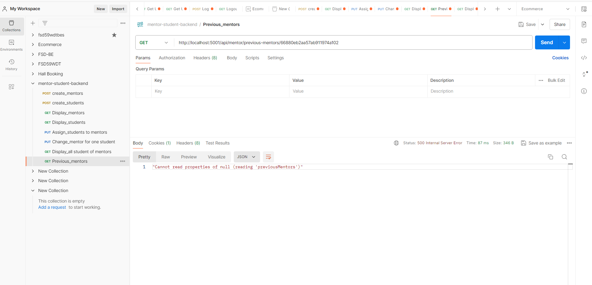

**WEB DEVELOPER TASK**

Mentor and Student Assigning with Database

Steps:

Backend:

1. Create an empty directory and open it in VS Code.
2. Open the terminal and run the following command to create a package.json file:  

npm init

3. create an entry point file (index.js).
4. Configure the package.json file. Add the following code:

"scripts": {
    "start": "node index.js"
  }

5. Create a readme.md file and add the project description.
6. Create an empty repository in GitHub.Com. Copy the repository URL.
7. Initialize the git repository in the project directory:

git init

8. Add the remote repository URL:

git remote add origin <repository-url>

9. Create a .gitignore file and add the following code:

node_modules
package-lock.json
DS_Store
.env

10. Rename the default branch from master to main:

git branch -m main

11. Add the changes to the staging area:
git add .
12. Commit the changes:

git commit -m "basic backend application setup"

13. Push the changes to the remote repository:
 
git push -u origin main

Database Setup:

- Visit MongoDB.Com and create an account.
- Create a new project and cluster.
- Create a new user and password.
- Open database access if necessary to change the user credentials and privileges.
- Open network access to allow connections from anywhere by adding the IP address 0.0.0.0/0.
- Create a new database and a collection.
- Copy the connecting string from the cluster.
- Install mongodb compass and connect to the database using the connecting string.

From the backend, connect to the database:

- Copy the connection string from the cluster.
- Install mongoose:

npm install mongoose

- In the index.js file, add the following code:

const mongoose = require('mongoose');

mongoose.connect(connection_string);

- Install dotenv:

npm install dotenv

- Create a .env file and add the connection string:

MONGODB_URI=connection_string

- Require the dotenv package in the index.js file:

require('dotenv').config();

- Change the connection string in index.js inside mongoose.connect() function to

process.env.MONGODB_URI

- Add the .env file to the .gitignore file.

- Create a config.js file under the utils folder and add the following code:

require('dotenv').config();

const MONGODB_URI = process.env.MONGODB_URI;

module.exports = {
    MONGODB_URI
};
- Require the config.js file in the index.js file:
const { MONGODB_URI } = require('./utils/config');

Assign-Mentor API This documentation provide

Base URL: http://localhost:5000

1. Write API to create Mentor.   

 POST-method (http://localhost:5000/api/mentors/create)

2. Write API to create Student.  

POST-method (http://localhost:5000/api/students/create)

3. Write API to Assign a student to Mentor

- Display All Mentors.   

GET-method (http://localhost:5001/api/mentor/all-mentors)
 

- Display All Students.   

GET-method (http://localhost:5001/api/student/all-students)

- Assign students to mentor.  

PUT-method (http://localhost:5001/api/mentor/assign/66880eb2aa57ab911974a102)

4. Write API to Assign or Change Mentor for particular Student.  

PUT-method (http://localhost:5001/api/mentor/assign/66880eb2aa57ab911974a102)

5. Write API to show all students for a particular mentor.   

GET-method (http://localhost:5001/api/mentor/students/66880eb2aa57ab911974a102)   

6. Write an API to show the previously assigned mentor for a particular student.  

GET-method (http://localhost:5001/api/mentor/previous-mentors/66880eb2aa57ab911974a102)

